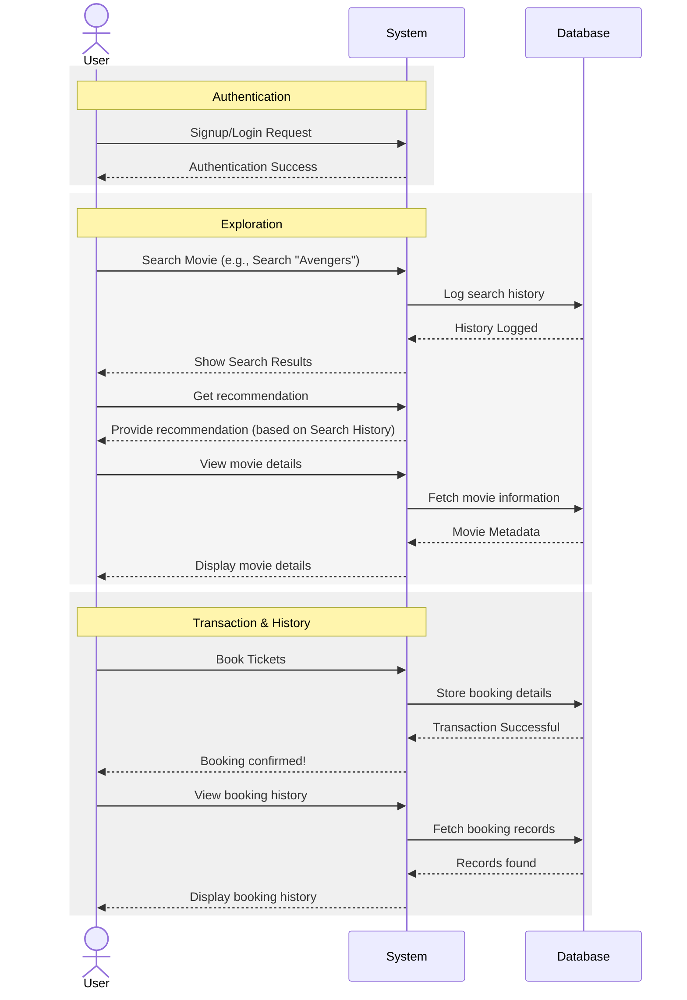

# Movie Booking System - Interaction Flow

This diagram illustrates the sequence of interactions between the **User** and the **System** based on the provided use case diagram.

## Description of Flows

- **Authentication**: Covers the `Signup` and `Login` use cases.
- **Exploration**: Covers `Search Movie`, `Get recommendation`, and `View movie details`. Notice how the system logs search history and fetches information.
- **Transaction**: Covers `Book Tickets` and the underlying `Store booking details` operation.
- **History**: Covers `View booking history`.
