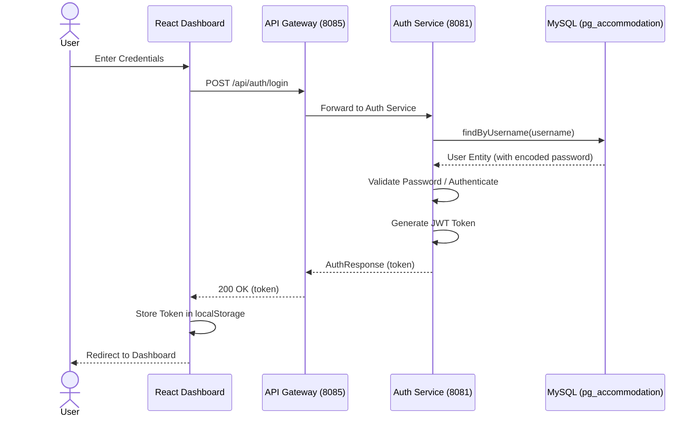
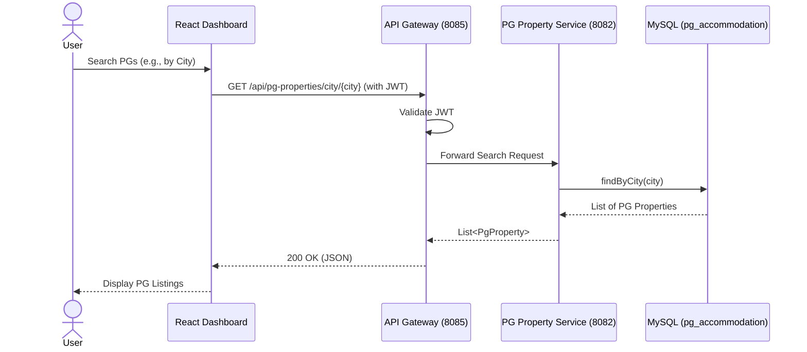
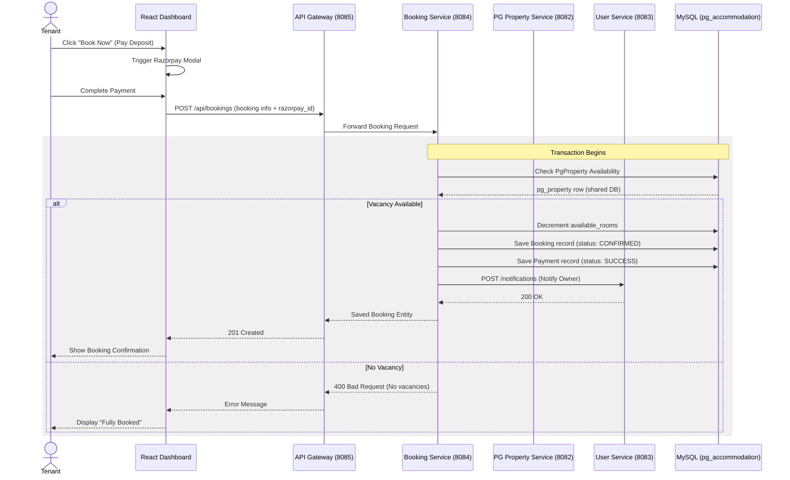

# PG Accommodation System - Sequence Diagrams

This document contains sequence diagrams illustrating the core interaction flows within the PG Accommodation microservices architecture.

## 1. Authentication Flow
This diagram shows how a user (Tenant/Owner/Admin) authenticates with the system to obtain a JWT token.

---

## 2. Property Discovery Flow
This flow illustrates how users browse and search for PG properties across the platform.

---

## 3. Booking and Payment Flow
This is the most critical flow, involving transaction management, availability updates, and cross-service notifications.

## Description of Interactions

- **Shared Database**: In this architecture, while services are separate, they currently share a single MySQL schema (`pg_accommodation`) for core data like `PgProperty`, which allows the `Booking Service` to perform availability checks and updates efficiently.
- **API Gateway**: Acts as the central security layer, validating JWT tokens before forwarding requests to downstream microservices.
- **User Service (Notifications)**: The `Booking Service` uses a `NotificationClient` (calling `user-service`) to alert the PG owner when a new guaranteed booking is made.
- **Payment Integration**: The frontend handles the active payment session with Razorpay, passing the resulting `payment_id` to the backend for verification and record-keeping during the booking creation process.
